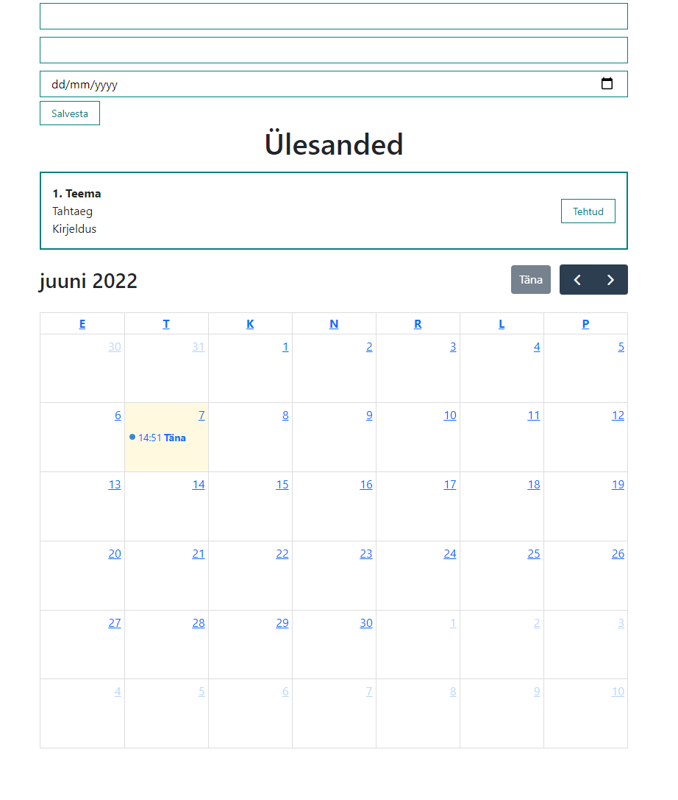

## Graagiku projekt
* Autor: Artjom Morozov


## Sisukord
* [Üldinfo](#general-info)
* [Tehnoloogiad](#technologies)
* [Käivitamine](#setup)

## Üldinfo
Antud projekt oli loodud tiimigraafiku ja jooksvate ülesannete kuvamiseks. Hetkel on tehtud enamus front-end'i, muidu on plaan edasi arendada, kuna tegu on reaalse projektiga, mida tiimis hiljem võetakse kasutusele.
	
## Tehnoloogiad
*Projekt on loodud kasutades React'i ja FullCalendar library't.
	
## Käivitamine
Projekti kävitamiseks installi lokaalselt kasutades npm:

```
$ cd ../lorem
$ npm install
$ npm start
```

## Ekraanitõmmis

