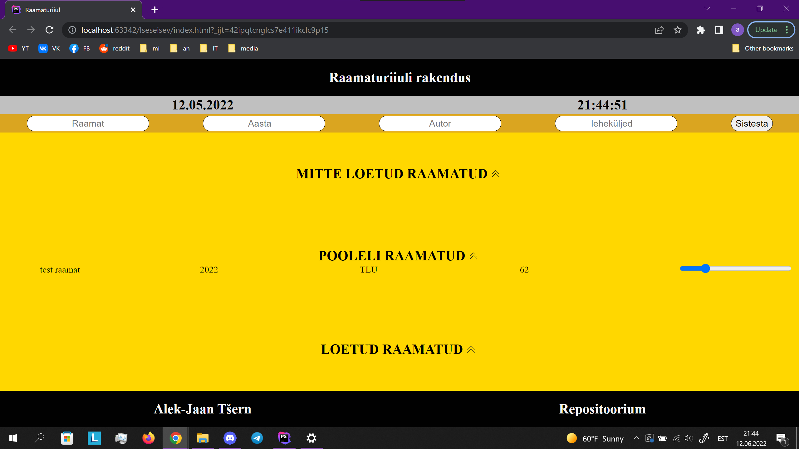
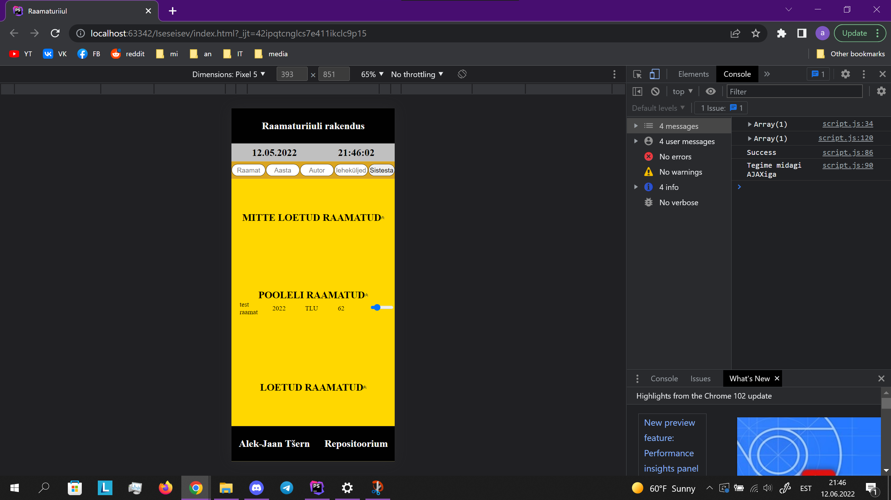

# Iseseisev töö - Raamaturiiuli rakendus

# Autor

* Alek-Jaan Tšern

## Kasutatud keeled ja tarkvara

* Windows 10
* HTML
* CSS
* PHP
* JS
* JQuery
* PhpStorm 2020.3.3

## Funktsionaalsus

* Responsive disain
* Link autori ja projekti repositooriumitele
* Kuupäev ja aeg lehel välja toodud
* PHP server ja txt (json kujul) database
* Võimalus lisada uue raamatu (vahetub värv)
* Võimalus vahetada praegust lehekülje slaideriga
* Drop down listi võimalus loodud

## Ekraanipildid

